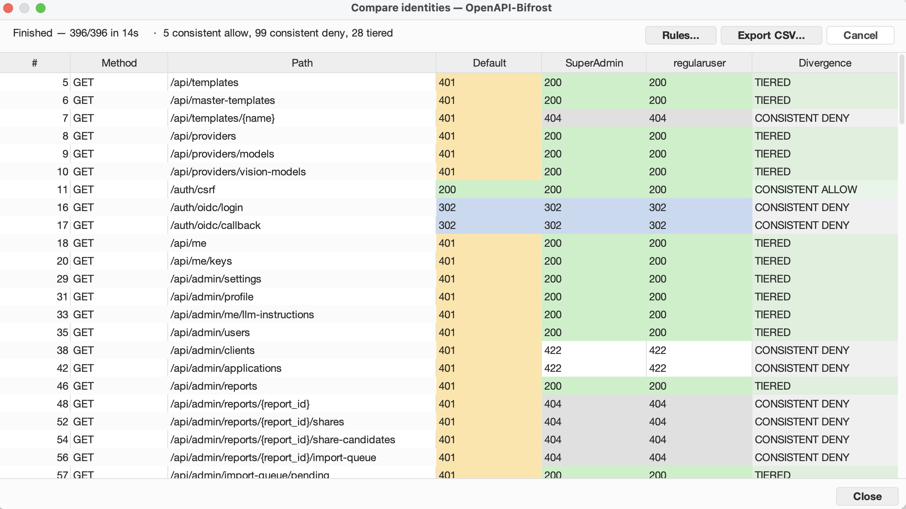

# OpenAPI-Bifrost

An alternative Burp Suite extension for loading OpenAPI specifications and bridging parsed endpoints into Scanner, Repeater, and Intruder — with a built-in **RBAC comparison grid** for testing authorization across multiple identities in a single pass.

Offers a different feature set to the existing OpenAPI Parser extension — not a replacement.


## The RBAC differentiator

Pick any subset of endpoints, right-click, and **Compare across identities** fires each request under each named identity you've configured. The resulting matrix highlights access patterns at a glance — coloured by status category, classified per-row by divergence (CONSISTENT ALLOW / CONSISTENT DENY / TIERED / DIVERGENT).



TIERED (green) is healthy role separation — lower-privilege identities denied, higher ones allowed. DIVERGENT (red) flags the anomalies: a regular user getting 2xx where an admin-only endpoint should deny.

Right-click any cell to send that exact (endpoint, identity) request to Repeater. Export the full matrix to CSV for reporting. Declare tag→tier rules (e.g. `Admin -> admin*`) to overlay violation assessments.

## Loading a spec

Three ways:

- **Drag and drop** a JSON/YAML file onto the drop zone
- **Paste a URL** (optionally filling the Extra Headers with any auth the spec endpoint requires)
- **Right-click any request in Proxy / Repeater / Logger → Send to OpenAPI-Bifrost** — auto-populates the host, copies auth (cookies, bearer tokens, API keys minus browser noise), and auto-parses if the response body is the spec. One click from "I have a working browser session" to "I have 132 parseable endpoints"
- **Paste raw spec text** into the textarea

Supports **OpenAPI 2.0 (Swagger) and OpenAPI 3.x** in both JSON and YAML.

## Authentication

One identity can be active at a time. Each holds its own:
- **Bearer token** (whitespace/newlines stripped automatically for multi-line JWT paste)
- **API key** — value, header name, and location (header / query / cookie)
- **HTTP Basic** — user + password (stored in JPasswordField)
- **Extra headers** — free-form textarea for anything else (`Cookie:`, `X-Tenant:`, `X-CSRF-Token:`, whatever). Overrides the above on collision, so you can paste raw headers verbatim from a working request.
- **Base URL override** — per-identity, so "admin on staging" and "user on prod" stay straight.

When a spec declares `components.securitySchemes`, the panel shows a one-line summary and pre-fills the API key header name if the spec uses one.

Identities persist across Burp restarts via the Java preferences store. Add / rename / delete from the Auth panel's dropdown.

## Sending to Burp tools

Select one or many endpoints → right-click → **OpenAPI-Bifrost** →
- **Actively Scan** (Pro only) — sends to Scanner with your active identity's auth, checks scope, fires a single audit task for the whole batch, surfaces HTTP 401/403 explicitly if the scope gate blocks you.
- **Send to Repeater** — one tab per endpoint, named `METHOD /path`.
- **Send to Intruder** — auto-marks URL, cookie, and body parameter values as insertion points (via Montoya's `REPLACE_BASE_PARAMETER_VALUE_WITH_OFFSETS`). Auth headers are not marked.
- **Compare across identities…** — the RBAC grid described above.

Ctrl+I / Cmd+I shortcut sends selection to Intruder.

## Usability details

- **Sortable columns** — click any header. `#` sorts numerically (not "1, 10, 11, 2").
- **Regex filter** (case-sensitive, capped at 500 chars to mitigate ReDoS). Live row counter.
- **Shell prompt stripping** — paste `anon@host:/mnt/d$ cat openapi.json` followed by the file's contents; leading prompt lines get dropped up to the first `openapi:` / `swagger:` / `{`.
- **Scope awareness** — Actively Scan aborts with a clear message if all selected endpoints are out of scope (Scanner otherwise silently drops them).

## Installation

1. Build: `./gradlew build`
2. In Burp: **Extensions → Installed → Add → Extension type: Java →** select `build/libs/OpenAPI-Bifrost-1.0.jar`

Requires Burp Suite with Montoya support. Active Scan and the Scanner send-to feature require Burp Suite Professional; everything else works on Community.

## Build

```bash
./gradlew build
```

Requires Java 17+. Runs the full unit-test suite, Cucumber BDD tests, and JaCoCo coverage verification (80% line coverage gate).

## License

MIT. See [LICENSE](LICENSE).
